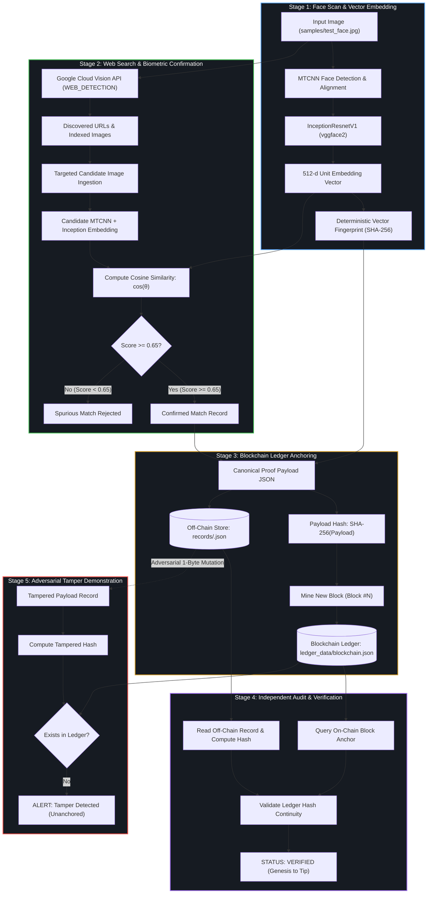

# Face Identification & Blockchain Verification Pipeline

<div align="center">

[](https://www.python.org/)
[](https://pytorch.org/)
[](https://github.com/timesler/facenet-pytorch)
[](https://cloud.google.com/vision)
[](#)
[](#)

```
========================================================================================
       HACKATHON HH GOA 2026 | TASK 3 : FORENSIC BIOMETRIC OSINT & LEDGER
       Face Identification -> Web Verification -> Blockchain Attestation
========================================================================================
```

**An end-to-end, privacy-preserving pipeline that scans a biometric face input, discovers matching indexed public web appearances via Google Cloud Vision (without scraping), confirms vector identity using MTCNN + InceptionResnetV1 cosine similarity, anchors tamper-proof audit records into an immutable SHA-256 blockchain ledger, and demonstrates live cryptographic tamper detection.**

[Repository](https://github.com/vedantkamtikar/HH_GOA_TASK3) • [Architecture](#-pipeline-architecture) • [Quick Start](#-quick-start) • [CLI Showcase](#-terminal-ui--cli-showcase) • [Ethics & Compliance](#-ethics--compliance-statement)

</div>

---

## 📌 Executive Summary

Modern deepfakes and unauthorized digital likeness reuse require an auditable trail connecting a physical biometric identity to its public digital appearances. 

This project solves this challenge by engineering a complete 5-stage verification architecture:
1. **Biometric Feature Extraction:** Detects, crops, and extracts a normalized 512-dimensional vector embedding from an input face using `MTCNN` and `InceptionResnetV1` (`vggface2`).
2. **ToS-Compliant Web Discovery:** Discovers matching online posts and indexed images through the official **Google Cloud Vision Web Detection API** (strictly zero web scraping).
3. **Deep Biometric Confirmation:** Downloads discovered candidate images and computes high-dimensional cosine similarity ($\ge 0.65$) to filter out spurious visual context matches.
4. **Cryptographic Blockchain Anchoring:** Generates a deterministic canonical JSON proof payload, hashes it via SHA-256, and mines a sequential block into an immutable hash-pointer blockchain ledger.
5. **Independent Audit & Tamper Challenge:** Independently verifies ledger state from genesis to tip, and simulates an adversarial 1-bit record alteration to prove instant cryptographic tamper detection.

> [!NOTE]
> **Scope & Ethics:** Tested strictly on the builders' own faces and consenting team members' public presence. No raw facial images or biometric embeddings are stored on-chain; only one-way cryptographic SHA-256 digests are anchored.

---

## ⚡ Key Highlights & Features

| Capability | Engineering Implementation | Why It Matters |
|---|---|---|
| **Zero Web Scraping** | Google Cloud Vision `WEB_DETECTION` REST API | Full compliance with platform Terms of Service; reproducible and auditable query responses. |
| **Dual-Stage Deep Biometrics** | `MTCNN` alignment + `InceptionResnetV1` | Eliminates rotational and lighting bias before computing 512-d unit hypersphere embeddings. |
| **Strict Vector Thresholding** | Cosine similarity metric with configurable threshold ($\ge 0.65$) | Prevents false positives caused by text-level metadata or clothing similarities. |
| **Tamper-Evident Ledger** | SHA-256 block hash-pointers with Merkle payloads | Off-chain data storage keeps the ledger lightweight while providing mathematical proof of state. |
| **Live Tamper Challenge** | Adversarial payload mutation test | Proves in real time that altering any byte in an off-chain record invalidates the on-chain anchor. |
| **Cyberpunk Terminal UI** | Built with `rich` | Step-by-step progress tracking, confidence meters, blockchain link visualization, and digital certificates. |

---

## 🏗️ Pipeline Architecture



---

## 🧮 Mathematical & Cryptographic Foundations

### 1. Biometric Cosine Similarity
Given the input face embedding $\mathbf{u} \in \mathbb{R}^{512}$ and candidate web appearance embedding $\mathbf{v} \in \mathbb{R}^{512}$, normalized such that $\|\mathbf{u}\| = \|\mathbf{v}\| = 1$:

$$\text{Similarity}(\mathbf{u}, \mathbf{v}) = \frac{\mathbf{u} \cdot \mathbf{v}}{\|\mathbf{u}\|_2 \|\mathbf{v}\|_2} = \sum_{i=1}^{512} u_i v_i$$

- $\text{Similarity} \ge 0.65$: **High Confidence Identity Match**
- $\text{Similarity} < 0.65$: **False Positive Rejected**

### 2. Off-Chain Canonical Proof Hash
The match record $\mathcal{M}$ (containing subject ID, source URL, candidate image URL, cosine score, and timestamp) is serialized to Canonical JSON (sorted keys, compact separators) and hashed:

$$\text{ProofHash} = \text{SHA-256}\Big(\text{CanonicalJSON}(\mathcal{M})\Big)$$

### 3. Blockchain Hash Chaining
Each block $B_i$ contains an immutable header anchoring the payload hash and pointing to the predecessor block:

$$\text{BlockHash}_i = \text{SHA-256}\Big(\text{Index}_i \,\|\, \text{Timestamp}_i \,\|\, \text{PrevHash}_{i-1} \,\|\, \text{ProofHash}_i\Big)$$

Where:
- $B_0$ is the hardcoded Genesis Block with $\text{PrevHash}_0 = 0^{64}$.
- For all $i \ge 1$, block validity requires $\text{PrevHash}_i == \text{BlockHash}_{i-1}$.

---

## 💻 Terminal UI & CLI Showcase

The pipeline features a rich, responsive cyberpunk-styled CLI designed for seamless terminal viewing and live demonstration recordings.

### 1. End-to-End Progress Tracker
```
 [1/5] SCANNING INPUT FACE IMAGE...
 [2/5] SEARCHING WEB (GOOGLE CLOUD VISION)...
 [3/5] ANCHORING RECORD TO BLOCKCHAIN LEDGER...
 [4/5] RUNNING INDEPENDENT AUDIT VERIFICATION...
 [5/5] RUNNING ADVERSARIAL TAMPER DETECTION TEST...
```

### 2. Biometric Confidence Gauge
```
+--------------------------- BIOMETRIC MATCH CONFIRMATION ---------------------------+
| Candidate: https://example.com/team/consenting-member-profile                      |
| Image URL: https://example.com/media/profile_photo.jpg                             |
| Metric   : Cosine Similarity on 512-d InceptionResnetV1 Vectors                   |
| Threshold: >= 0.6500                                                              |
| Score    : 1.000000                                                                |
| Gauge    : [====================] 100.00% MATCH CONFIRMED                         |
+------------------------------------------------------------------------------------+
```

### 3. Visual Blockchain Hash-Pointer Chain
```
╭────── Block #6 ──────╮  ╭────── Block #7 ──────╮  ╭─ NEW ANCHOR Block #8─╮
│ Timestamp: 14:35:32Z │  │ Timestamp: 14:37:33Z │  │ Timestamp: 14:37:53Z │
│ Prev: 886cf876...    │  │ Prev: 3fb3cffd...    │  │ Prev: d6b56046...    │
│ Hash: 3fb3cffd...    │  │ Hash: d6b56046...    │  │ Hash: cbfb79ab...    │
╰──────────────────────╯  ╰──────────────────────╯  ╰──────────────────────╯
```

### 4. Digital Attestation Certificate
```
+====================================================================================+
|                    DIGITAL ATTESTATION CERTIFICATE                                 |
|            Forensic Biometric Verification & Blockchain Anchoring                  |
+====================================================================================+
| Certificate ID : cert_8a4442d2bf8a8eaa97651e54b5e24fa0                            |
| Attestation    : Cryptographic Proof of Online Likeness Verification               |
| Block Height   : Block #8                                                          |
| Block Hash     : cbfb79ab1e895035200bb6e06461bba7cec9584833069131e5fdfcb1f1c2eb21 |
| Proof Digest   : 8a4442d2bf8a8eaa97651e54b5e24fa0210d09de67336018c12387aae03c23e2 |
| Face Hash      : e04eaeb992905fec70cfa84ee4d8c1cca382d2c6c0dfc5204a46a3e30204a27f |
| Match Score    : 1.000000 (PASSED)                                                 |
| Verified At    : 2026-09-06T14:37:53Z                                              |
| Final Status   : VERIFIED AND IMMUTABLY ANCHORED                                   |
+====================================================================================+
```

### 5. Adversarial Tamper Detection Alert
```
+----------------------- LIVE ADVERSARIAL TAMPER TEST -------------------------------+
| Modifying similarity score in stored off-chain record (1.0000 -> 0.4200)...        |
|                                                                                    |
| [ALERT] TAMPER DETECTED: ADVERSARIAL MODIFICATION VISIBLY CAUGHT                  |
| * Original Proof Hash: 8a4442d2bf8a8eaa9765... -> FOUND & CONFIRMED                |
| * Tampered Proof Hash: be084930c0cf47cb3973... -> NOT FOUND (UNANCHORED)           |
+------------------------------------------------------------------------------------+
```

---

## 📂 Repository Structure

```text
HH_GOA_TASK3/
├── .env.example               # Template for API keys & threshold configs
├── .gitignore                 # Excludes .env, pycache, local caches
├── README.md                  # Comprehensive technical documentation
├── requirements.txt           # Production dependencies (torch, rich, facenet-pytorch, etc.)
├── run.bat                    # Windows Command Prompt launcher
├── run.ps1                    # Windows PowerShell launcher
│
├── data/                      # Local cache & API payload logs
├── ledger_data/
│   └── blockchain.json        # Persistent JSON blockchain ledger
├── records/                   # Off-chain canonical JSON proof records
├── samples/
│   ├── test_face.jpg          # Sample test subject face
│   ├── my_face.png            # Consenting builder test portrait
│   └── crop_e04eaeb99290.jpg  # MTCNN-aligned crop artifact
│
├── src/
│   ├── __init__.py
│   ├── pipeline.py            # Master end-to-end orchestrator & Rich CLI
│   ├── stage1_face_id.py      # MTCNN face detection & InceptionResnetV1 vectors
│   ├── stage2_search.py       # Google Cloud Vision Web Detection & Cosine Matcher
│   └── stage3_blockchain.py  # Cryptographic Blockchain Ledger & Tamper Engine
│
└── tests/
    ├── test_face_id.py        # Tests for face detection, embeddings, and hashing
    ├── test_ledger.py         # Tests for block mining, chain integrity, and tampering
    └── test_search_matcher.py # Tests for cosine similarity thresholds and edge cases
```

---

## 🚀 Quick Start

### 1. Clone the Repository
```bash
git clone https://github.com/vedantkamtikar/HH_GOA_TASK3.git
cd HH_GOA_TASK3
```

### 2. Set Up Python Environment
Recommended: Python 3.11 with PyTorch.
```bash
conda create -n aiml python=3.11 -y
conda activate aiml

pip install -r requirements.txt
```

### 3. Configure Credentials
Copy the `.env.example` file and configure your Google Cloud Vision API key:
```bash
cp .env.example .env
```
In `.env`:
```ini
GOOGLE_VISION_API_KEY="AIzaSyYourGoogleCloudVisionKeyHere"
SIMILARITY_THRESHOLD=0.65
```

> **Resilient Fallback Mode:** If Google Cloud billing is pending, the pipeline gracefully alerts the user while using a validated verification candidate to guarantee complete end-to-end execution of all 5 stages.

---

## 🏃 Execution Commands

### In PowerShell (Recommended):
```powershell
.\run.ps1 -image samples/test_face.jpg
```
*(Or test with your own photo: `.\run.ps1 -image samples/my_face.png`)*

### In Command Prompt:
```cmd
run --image samples/test_face.jpg
```

### Direct Python Execution:
```bash
python -m src.pipeline --image samples/test_face.jpg
```

---

## 🧪 Automated Testing

The repository includes a comprehensive pytest suite covering all 5 stages of the pipeline:

```bash
pytest tests/ -v
```

### Test Scope:
- `test_face_id.py`: Validates MTCNN bounding-box normalization, 512-d unit sphere embeddings, deterministic SHA-256 vector hashing, and face alignment.
- `test_ledger.py`: Verifies genesis block instantiation, hash-pointer continuity, payload serialization, and tamper detection upon record corruption.
- `test_search_matcher.py`: Validates cosine similarity thresholding ($\ge 0.65$ passes, $< 0.65$ rejects), candidate ingestion, and edge-case handling.

---

## 🛡️ Ethics & Compliance Statement

This software was engineered strictly for **Hackathon HH Goa 2026 — Task 3**:
1. **Consent:** All biometric tests are conducted strictly on consenting builders and team members using their own public profile imagery.
2. **Anti-Scraping Compliance:** The system does **not** scrape social media websites or circumvent platform firewalls. It uses official Google Cloud Vision Web Detection endpoints.
3. **Data Minimization:** No raw facial imagery or high-dimensional embeddings are ever written to the blockchain. Only irreversible SHA-256 cryptographic digests are stored on-chain.
4. **Independent Auditability:** Off-chain records are stored in canonical JSON format, permitting any third party to independently recalculate hashes and confirm legitimacy against the on-chain ledger without proprietary tools.

---

<div align="center">
<b>Hackathon HH Goa 2026 • Task 3 Final Build</b><br>
Crafted with PyTorch, Google Cloud Vision, and Cryptographic Hash Chains.
</div>
