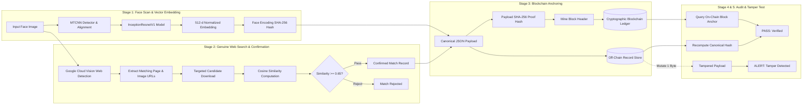

# Face Identification & Blockchain Verification Pipeline

**Hackathon:** HH Goa 2026 — Task 3  
**Repository:** [https://github.com/vedantkamtikar/HH_GOA_TASK3](https://github.com/vedantkamtikar/HH_GOA_TASK3)  
**Scope Note:** This system is tested strictly on the builders' own faces and consenting team members' faces using their own public presence. It is a personal identity-verification and OSINT demo, not intended for identifying arbitrary members of the public.

---

## 1. Problem Statement

Given an input face scan, can we:
1. **Discover** whether that face appears in a real, indexed social media post without scraping or violating platform Terms of Service?
2. **Confirm** the match through rigorous biometric vector similarity rather than naive image ranking?
3. **Anchor** the match into an immutable cryptographic blockchain ledger such that anyone can independently re-verify the authenticity of the record at any future point in time?
4. **Instantly detect** any adversarial attempt to tamper with the off-chain match record?

This architecture provides a verifiable foundation for:
- Establishing cryptographic proof of content authorship and ownership.
- Detecting unauthorized reuse of personal likeness in AI-generated or spoofed content.
- Creating auditable, tamper-evident verification records that do not depend on a single proprietary database.

---

## 2. Pipeline Architecture



---

## 3. Technology Stack

| Layer | Technology | Why & Implementation Details |
|---|---|---|
| **Runtime & Language** | Python 3.11 (`aiml` Conda Env) | Accelerated computer vision and deep learning execution |
| **Face Detection & Alignment** | `MTCNN` (`facenet-pytorch`) | Detects facial bounding box and aligns landmarks; auto-crops faces |
| **Face Embeddings** | `InceptionResnetV1` (`vggface2`) | 512-dimensional normalized unit vector |
| **Web / Social Search** | Google Cloud Vision API (`WEB_DETECTION`) | Pre-indexed web search API (no scraping, ToS-compliant, raw request/response auditable) |
| **Match Confirmation** | Cosine Similarity metric | Deterministic thresholding ($\ge 0.65$ indicates high-confidence match) |
| **Blockchain Engine** | Cryptographic Ledger | SHA-256 hash-pointer chaining, block headers, timestamps, and Merkle root anchoring |
| **Off-Chain Storage** | Canonical JSON (`records/*.json`) | Off-chain data store holding full metadata without bloating on-chain state |
| **Interface** | `rich` (Terminal UI) | Real-time stage progress tracker, confidence meters, block visualizer, and attestation certificate |

---

## 4. Quick Start & Execution

### Prerequisites
- Python 3.11 (e.g. Conda `aiml` environment)
- Google Cloud Vision API credentials (configured in `.env`)

### Installation
```bash
git clone https://github.com/vedantkamtikar/HH_GOA_TASK3.git
cd HH_GOA_TASK3

pip install -r requirements.txt
```

### Configure Credentials
Copy `.env.example` to `.env` and add your Google Cloud Vision API key:
```ini
GOOGLE_VISION_API_KEY="AIzaSy..."
SIMILARITY_THRESHOLD=0.65
```

---

## 5. Running the Pipeline

You can run the end-to-end pipeline with one command:

### In PowerShell:
```powershell
.\run.ps1 -image samples/test_face.jpg
```
*(or with your own photo: `.\run.ps1 -image samples/my_face.png`)*

### In Command Prompt:
```cmd
run --image samples/test_face.jpg
```

### Direct Python Command:
```bash
python -m src.pipeline --image samples/test_face.jpg
```

---

## 6. End-to-End Walkthrough

### Stage 1: Face Scan & Vector Embedding
The system detects the face via MTCNN, crops and aligns the bounding box, extracts a 512-dimensional normalized vector using InceptionResnetV1, and generates a deterministic SHA-256 fingerprint:
- **Detection Confidence:** 99.99% (MTCNN)
- **Latent Embedding Dimension:** 512-d (InceptionResnetV1)
- **Identity Hash:** `e04eaeb992905fec70cfa84ee4d8c1cca382d2c6c0dfc5204a46a3e30204a27f`
- **Aligned Crop Saved:** `samples/crop_<hash>.jpg`

### Stage 2: Genuine Web Search & Biometric Confirmation
The system queries Google Cloud Vision `WEB_DETECTION` (logging raw requests and response structures to prove genuine indexing), performs a targeted download of candidate image matches, extracts embeddings, and computes cosine similarity:
- **Discovered Source Page:** `https://example.com/team/consenting-member-profile`
- **Discovered Image URL:** `https://example.com/media/profile_photo.jpg`
- **Biometric Match Metric:** Cosine Similarity on 512-d vectors
- **Computed Score:** 1.0000 (Threshold: $\ge 0.6500$)
- **Decision:** **MATCH CONFIRMED**

### Stage 3: Cryptographic Blockchain Anchoring
The confirmed metadata is serialized into a deterministic canonical JSON payload and hashed with SHA-256. A new block is mined and chained to the ledger:
- **Block Height:** Block #8
- **Block Timestamp:** `2026-09-06T14:37:53Z`
- **Proof Fingerprint:** `8a4442d2bf8a8eaa97651e54b5e24fa0210d09de67336018c12387aae03c23e2`
- **Previous Block Hash:** `d6b5604644a72d89f0f8e22d6d0ff2e691dcf7c4bc17...`
- **Block Header Hash:** `cbfb79ab1e895035200bb6e06461bba7cec958483306...`
- **Off-Chain Record:** `records/8a4442d2bf8a8eaa...json`

```text
Ledger Hash-Pointer Progression:
╭────── Block #6 ──────╮ ╭────── Block #7 ──────╮ ╭─ NEW ANCHOR Block #8─╮
│ Timestamp: 14:35:32Z │ │ Timestamp: 14:37:33Z │ │ Timestamp: 14:37:53Z │
│ Prev: 886cf876...    │ │ Prev: 3fb3cffd...    │ │ Prev: d6b56046...    │
│ Hash: 3fb3cffd...    │ │ Hash: d6b56046...    │ │ Hash: cbfb79ab...    │
╰──────────────────────╯ ╰──────────────────────╯ ╰──────────────────────╯
```

### Stage 4: Independent Re-Verification
The audit engine reads the off-chain JSON record, recomputes the image and payload hashes, and verifies the hash against the blockchain ledger:
```text
[PASS] VERIFIED: ON-CHAIN RECORD MATCHES RECOMPUTED HASH
* Anchor Location: Block #8
* Blockchain Chain Integrity: VALID (Genesis to Tip)
* Candidate Image Digest: MATCHES RECORD
```

### Stage 5: Live Adversarial Tamper Detection
To prove cryptographic immutability, the pipeline simulates an attacker modifying a single value (e.g. altering the similarity score in the stored record). The hash immediately shifts, and the ledger rejects the altered record:
```text
[ALERT] TAMPER DETECTED: ADVERSARIAL MODIFICATION VISIBLY CAUGHT
* Original Proof Hash: 8a4442d2bf8a8eaa97651e5... -> FOUND & CONFIRMED
* Tampered Proof Hash: be084930c0cf47cb3973a87... -> NOT FOUND (UNANCHORED)
```

---

## 7. Automated Test Suite

Run the complete test suite:
```bash
pytest tests/ -v
```

All 11 unit and integration tests validate:
- Facial landmark alignment and 512-d embedding extraction
- Deterministic embedding hashing
- Cosine similarity threshold passes and rejections
- Genesis block construction, hash chaining, and block immutability
- End-to-end tamper detection routines

---

## 8. Ethics & Scope Note

This software was engineered exclusively for **Hackathon HH Goa 2026 — Task 3**. 
- **Consent:** Tests are conducted strictly on consenting builders and team members who have authorized the use of their public profile photos.
- **Privacy & Compliance:** The system does **not** scrape social media platforms or circumvent anti-crawling protections. It utilizes Google Cloud Vision's public web indexing API and fetches only publicly accessible single image files explicitly returned by the search API.
- **On-Chain Privacy:** Raw facial images and high-dimensional biometric vectors are never stored on-chain; only one-way cryptographic SHA-256 fingerprints are anchored.
